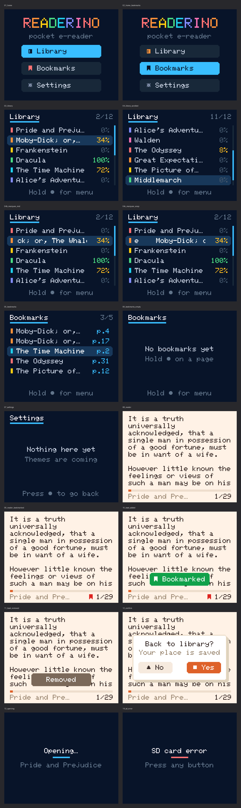

# readerino

A pocket e-reader built from a microcontroller, a small screen, an SD card,
and three buttons. No touchscreen, no WiFi dependency, no bloat — just a
small library you can browse and read with almost no lag.

There are two hardware builds:

- **Arduino Nano + 1.8" color TFT** (`firmware/readerino_nano/`) — the
  current one. Landscape 160x128 color UI on a classic ATmega328P (2KB RAM,
  32KB flash). See [Nano build](#nano-build) below.
- **ESP32 + 1.3" OLED** (`firmware/readerino/`) — the original. Library
  screen with reading progress, a bookmarks view, and a paginated reader.

Both read the same library format, produced by:

- **Packer** (`packer/`) — a Python CLI that turns `.txt`/`.pdf`/`.epub`
  files into the binary format the device reads, and pushes them onto the
  SD card over the same USB cable used to flash the firmware.

## Nano build



A home menu, a dark library screen (colored book spines, per-book progress
that turns amber while you're reading and green when you finish, a
scrollbar, a `3/52` counter), a bookmarks list across every book, and a
warm-paper reader (24 columns x 10 lines, a progress
bar, the title, the page number, and a red ribbon on bookmarked pages).

### Controls

Three buttons: ▲ triangle (up), ● circle (center), ■ square (down). The
screens use the same shapes, e.g. the exit dialog reads "▲ No" / "■ Yes".

- **Menu** — up/down to pick Library, Bookmarks or Settings, center to open
- **Library / Bookmarks** — up/down to move, center to open the book (a
  bookmark opens at its page), hold center to go back to the menu. A
  selected title too long for its row scrolls like a track name on Spotify
- **Reading** — down/up to turn pages; hold center to bookmark the page, or
  to remove the bookmark if it already has one; tap center for "Back to
  library?" (down = yes and save your place, up = keep reading)
- **Settings** — empty for now, center goes back

### Hardware and pins

| Part | Pin | Nano |
|---|---|---|
| 1.8" ST7735 TFT | LED | D6 |
| | SCK | D13 |
| | SDA | D11 |
| | A0 (data/command) | D8 |
| | RESET | D7 |
| | CS | D9 |
| SD card module (3.3V-only) | CS | D10 via divider |
| | MOSI | A5 via divider |
| | CLK | A4 via divider |
| | MISO | A0, direct |
| | 3V3 | 3V3 |
| Buttons (to GND) | up / select / down | D3 / D4 / D5 |

The SD module has no level shifter, so CS, MOSI and CLK each go through a
5V → ~3.3V resistor divider (two equal resistors in parallel on the Nano
side, one more of the same value to GND). The TFT gets the hardware SPI
bus to itself; the SD card is bit-banged on A0/A4/A5 by a patched copy of
the SD library in `firmware/local_libraries/SD` (sharing one bus between
the two broke the card).

The display driver (`Tft.cpp`) is a small hardware-SPI ST7735 driver
written for this build instead of Adafruit_GFX: every text box is streamed
as one address window with its background, so each pixel is sent once, and
it leaves ~8KB of flash free for future features.

### Designing screens on a PC

`tools/simulator/simulate.py` renders every screen pixel for pixel from the
firmware's own `Theme.h` (all colors and layout numbers) and `Font.h`, so
you can tweak the design without flashing:

```bash
python3 tools/simulator/simulate.py      # -> tools/simulator/out/*.png
```

### Building, flashing, pushing books

Clone Nanos with the old bootloader need `cpu=atmega328old` to upload.

```bash
cd firmware
arduino-cli compile --fqbn arduino:avr:nano --library local_libraries/SD readerino_nano
arduino-cli upload -p /dev/ttyUSB0 --fqbn arduino:avr:nano:cpu=atmega328old readerino_nano

cd ../packer
python3 pack.py ~/books -o ../library                  # wraps at 24 columns
python3 push_to_sd.py ../library/*.rbk ../library/catalog.bin
```

A full 3.5MB library takes about 9 minutes to push at the Nano's 115200 baud.

## Why a custom binary format

The obvious first version just drops `.txt` files on the SD card and
word-wraps them on the device when you open a book. That works, but it's
slow in two ways that actually matter on a microcontroller:

1. Opening a book means scanning the whole file byte-by-byte to figure out
   where every wrapped line starts. Fine for a short essay, noticeably slow
   for anything book-length.
2. If you track reading progress per file (say, in a JSON blob), saving your
   position means rewriting that whole file every time you turn a page.

So the packer does the expensive part — word-wrapping and precomputing a
line-offset table — once, on a real computer, and ships the result as a
`.rbk` file the device can page through with a handful of `seek()` calls. A
`catalog.bin` index sits alongside it with fixed-size records (title,
author, progress, bookmarks) so updating your position or adding a bookmark
is a single in-place write, not a rewrite of the whole index.

Concretely: the library screen used to re-scan the entire catalog (all of
it, every book) on *every single button press* just to redraw a 6-row list.
On a library of 200+ books that was a two-second stall per keypress. Fixing
it to only fetch the rows actually on screen — and keeping the catalog file
open instead of reopening it constantly — took that down to well under
100ms. Numbers like that are why this format exists instead of "just read
the text file."

## ESP32 build

### Hardware

| Component | Interface | Notes |
|---|---|---|
| ESP32 DevKit | — | any 30/38-pin board |
| 1.3" OLED, 128x64 | I2C | SH1106-family driver |
| SD card module | SPI | 3.3V native (no level shifter needed) |
| 3x momentary buttons | GPIO | wired to GND, internal pull-ups |

#### Pinout

| Signal | ESP32 pin |
|---|---|
| SD CS | GPIO5 |
| SD MOSI | GPIO23 |
| SD MISO | GPIO19 |
| SD CLK | GPIO18 |
| OLED SDA | GPIO21 |
| OLED SCL | GPIO22 |
| Button 1 (up / back) | GPIO32 |
| Button 2 (select) | GPIO33 |
| Button 3 (down / forward) | GPIO27 |

SD uses the ESP32's default VSPI pins, OLED uses the default I2C pins — both
work with the stock `SD.begin()` / `Wire.begin()` calls, no custom bus setup
needed.

### Controls

**Library / bookmarks screens**
- Button 1 / Button 3 — move selection up / down
- Button 2 — open the selected book (or enter the highlighted view)

**Reading a book**
- Button 3 — next page, Button 1 — previous page
- Hold Button 2 — bookmark the current page
- Short-press Button 2 — asks "back to menu?" (Button 3 = yes, saves your
  position; Button 1 = no, keep reading)

A title too long to fit a row scrolls like a track name on Spotify — only
the selected row animates, everything else just truncates.

### Getting books onto the device

The SD card is wired to the ESP32, not to your computer, so there's no way
to just mount it and drag files over. Instead, the firmware exposes a tiny
serial protocol (see `firmware/readerino/Transfer.h`) that lets a host
script push files through the same USB cable used to program the board.

```bash
cd packer
pip install -r requirements.txt

# 1. Pack your books into the device's binary format (21 columns for the OLED)
python3 pack.py ~/books/*.pdf ~/books/*.epub ~/notes/*.txt -o ../library --width 21

# 2. Push the packed library onto the SD card over serial
python3 push_to_sd.py --device esp32 ../library/*.rbk ../library/catalog.bin -p /dev/ttyUSB0
```

Re-running the packer against files you've already packed updates them in
place without losing your reading position or bookmarks — it tracks
source-file → book-id mappings in a local `.pack_manifest.json` so it knows
what's already there.

### Building and flashing

Built with [arduino-cli](https://arduino.github.io/arduino-cli/) against the
`esp32:esp32` core.

```bash
cd firmware
arduino-cli compile --fqbn esp32:esp32:esp32 readerino
arduino-cli upload -p /dev/ttyUSB0 --fqbn esp32:esp32:esp32 readerino
```

Dependencies (installed via `arduino-cli lib install`): `Adafruit SH110X`,
`Adafruit GFX Library`, `Adafruit BusIO`, `SD`.

## Project layout

```
firmware/readerino_nano/  Arduino Nano sketch
  Theme.h             every color and layout number (read by the simulator too)
  Font.h              5x7 glyphs + icon glyphs
  Tft.*               lean ST7735 hardware-SPI driver
  Display.*           screens (library, reader, dialog, toast, messages)
firmware/local_libraries/SD/  SD library patched for software SPI on A0/A4/A5
tools/simulator/      renders the Nano screens to PNG on a PC
firmware/readerino/   ESP32 sketch
  App.*               state machine (library / bookmarks / reading / confirm)
  Display.*           OLED rendering
  Storage.*           catalog.bin reader/writer
  Book.*              .rbk file reader
  Buttons.*           debounced input with long-press detection
  Transfer.*          serial protocol for pushing files onto the SD card
packer/               host-side Python tool
  extract.py          txt/pdf/epub → plain text
  textutil.py         word-wrap + ASCII sanitization
  formats.py          .rbk / catalog.bin binary layout
  pack.py             CLI entry point
```
